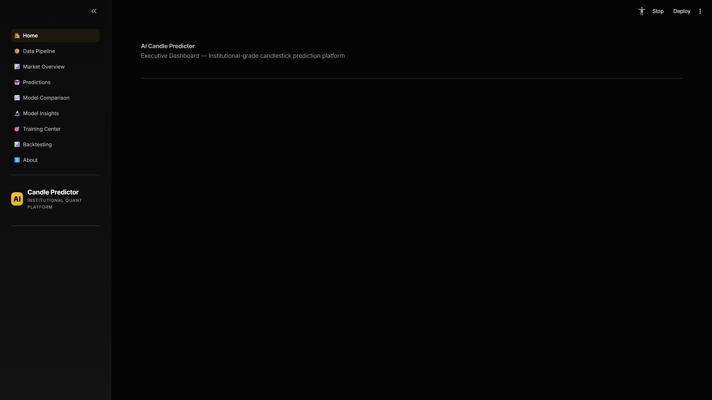
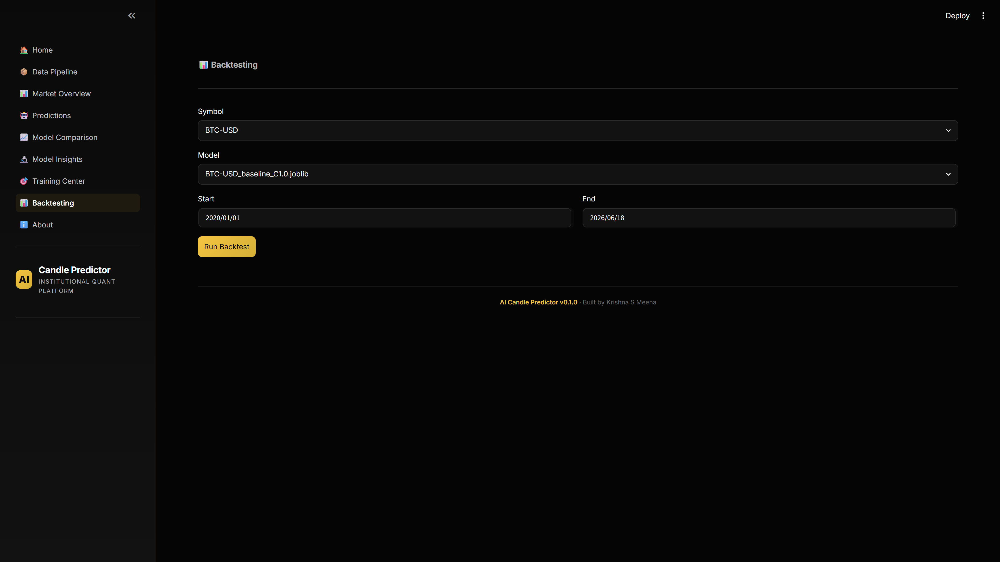

# AI-Driven Candlestick Prediction Platform

[](https://www.python.org/)
[](https://github.com/astral-sh/uv)
[](https://github.com/Krishna-Meena/ai-driven-candle-stick-prediction/actions)
[](LICENSE)
[](https://github.com/psf/black)

A production-grade machine learning and quantitative trading platform that predicts asset candlestick price directions using technical indicators, ensemble models (Logistic Regression, Random Forest, XGBoost), and hyperparameter optimization — served through an institutional Streamlit dashboard, a FastAPI REST service, and a command-line interface.

Built with **Clean Architecture** patterns, strict **Dependency Inversion**, and high test coverage.

---

## Key Features

| Category | Feature | Description |
|---|---|---|
| **Machine Learning** | **Ensemble Modeling** | Trains Logistic Regression, Random Forest, and XGBoost models on-demand. |
| | **Hyperparameter Tuning** | Integrates Optuna-backed Bayesian optimization for optimal trial tuning. |
| | **Model Registry** | JSON-backed registry tracking training dates, types, and out-of-sample metrics. |
| **Data Engine** | **Multi-Asset Ingestion** | Vectorized historical candle data retrieval via Yahoo Finance. |
| | **Feature Calculation** | Computes 8+ indicator features (RSI, MACD, Bollinger Bands, ATR, ADX) via `pandas-ta`. |
| | **Label Engineering** | Labels future price directions based on return thresholds and horizons. |
| **Quantitative** | **Backtesting Engine** | Simulates strategy performance, calculating Sharpe Ratio, Win Rate, and Max Drawdown. |
| | **Performance Metrics** | Generates real-time comparisons of model performance and feature importances. |
| **Deployment** | **Multi-Interface Serving** | Includes a Streamlit dashboard, a FastAPI REST API, and a Typer CLI. |
| | **CI/CD & Testing** | Parallelized GitHub Actions for Black, Ruff, Mypy, and Pytest coverage validation. |
| | **Dockerized** | Ready-to-go Docker container configurations for isolated deployments. |

---

## Dashboard Preview

The application contains 7 fully styled Bloomberg-inspired Black & Gold dashboard pages:

```
Home (KPI Overview) → Market Overview → Predictions → Training Center → Backtesting → Model Comparison → About
```

### Home Page


### Backtesting Simulator


---

## System Architecture

The project enforces **Clean Architecture** guidelines. The core business rules and entities reside in the Domain layer and have absolutely zero external dependencies. The outer infrastructure layers depend only on ports (abstractions).

```
src/ai_candle_predictor/
├── domain/            # Core business entities, value objects, and domain events (zero external dependencies)
├── application/       # Orchestration layer, use cases, ports (interfaces), and DTO definitions
├── infrastructure/    # Persistence (Parquet), data providers (Yahoo), model serving, and visualizations
└── presentation/      # Streamlit Dashboard, FastAPI web service, and Typer CLI commands
```

For a detailed breakdown of components, lifecycle, and diagrams, read the [ARCHITECTURE.md](docs/ARCHITECTURE.md) document.

---

## Project Workflow & Data Flow

```
   [ Yahoo Finance API ]
             │
             ▼
   [ Data Ingestion Use Case ]  ──>  [ Validated CandleStick Entities ]  ──>  [ ParquetStore (.parquet) ]
                                                                                         │
                                                                                         ▼
   [ Feature Store (indicators) ]  <──  [ Feature Engineering (computations.py) ]  <──────┘
   [ Label Store (returns)      ]  <──  [ Label Generator (forward returns)     ]
             │
             ▼
   [ Model Training / Tuning Use Case ]  ──>  [ Optuna Optimizer ]  ──>  [ JoblibStore (.joblib) ]
                                                                                   │
                                                                                   ▼
   [ Streamlit UI / FastAPI / CLI ]  <──  [ Inference engine (predict_range) ]  <──┘
```

---

## Technical Stack

- **Core Framework**: Python 3.13, Pydantic v2 (Validation), Typer (CLI), FastAPI (REST API), Streamlit (UI).
- **Data & Computations**: Pandas, NumPy, PyArrow (Parquet storage), pandas-ta (Technical indicators).
- **Machine Learning**: Scikit-learn, XGBoost, Optuna (Bayesian optimization), Joblib (Serialization).
- **Visualizations**: Plotly (Interactive charts), Matplotlib, mplfinance (Candlestick rendering).
- **Quality Gates**: Pytest (Testing), Black (Formatting), Ruff (Linting), Mypy (Type Safety).

---

## Machine Learning & Backtesting Engine

### 1. Ingestion & Labeling
- Markets are ingested using the Yahoo Finance provider.
- Classification targets are labeled:
  $$Y_{t} = \begin{cases} 1 & \text{if } R_{t, t+h} \ge \theta \\ 0 & \text{if } R_{t, t+h} \le -\theta \\ \text{Excluded} & \text{otherwise} \end{cases}$$
  Where $R_{t, t+h}$ represents the cumulative forward return over horizon $h$, and $\theta$ is the minimum return threshold.

### 2. Backtesting Simulator
The quantitative backtester runs strategy simulations. The engine calculates portfolio equity curves, drawdown series, and Sharpe Ratio metrics:
$$\text{Sharpe Ratio} = \frac{\mathbb{E}[R_s - R_f]}{\sigma_s} \times \sqrt{252}$$
Where $R_s$ is the strategy excess return, $R_f$ is the risk-free rate, and $\sigma_s$ is the standard deviation of daily strategy returns.

---

## Installation (using `uv`)

Prerequisites: Ensure **Python 3.13** and **uv** are installed on your system.

### 1. Clone & Set Up Directory
```bash
git clone https://github.com/Krishna-Meena/ai-driven-candle-stick-prediction.git
cd ai-driven-candle-stick-prediction
```

### 2. Sync Virtual Environment
Sync all dependencies, development tools, and package extras (FastAPI, XGBoost, Optuna):
```bash
uv sync --all-extras --group dev
```

---

## Quick Start

Activate your virtual environment and run the following commands:

### A. Run Streamlit UI Dashboard
```bash
uv run streamlit run src/ai_candle_predictor/presentation/dashboard/app.py
```
*Opens at `http://localhost:8501`*

### B. Run FastAPI REST API Server
```bash
uv run ai-candle-predictor serve --port 8000
```
*Open Swagger API documentation at `http://localhost:8000/docs`*

### C. Run Command Line Interface (CLI)
```bash
# Ingest raw market candles
uv run ai-candle-predictor ingest --symbol BTC-USD --start-date 2024-01-01

# Compute indicator features
uv run ai-candle-predictor compute-features --symbol BTC-USD

# Run predictions and print classification metrics
uv run ai-candle-predictor predict --symbol BTC-USD --model "Random Forest"
```

---

## Docker Deployment

Build the container image:
```bash
docker build -t ai-candle-predictor .
```

Run the Streamlit Dashboard:
```bash
docker run -p 8501:8501 -v $(pwd)/data:/app/data -v $(pwd)/models:/app/models ai-candle-predictor
```

---

## Testing & Code Quality Gates

Before committing changes, execute the validation gates to ensure complete stability:

```bash
# Format checks
uv run black --check src/ tests/

# Style linter
uv run ruff check src/ tests/

# Strict type definitions
uv run mypy src/ tests/

# Execute all 180+ tests
uv run pytest
```

---

## Future Roadmap

- [ ] **SHAP Explainability Integration**: Build on-demand model-agnostic feature attribution charts.
- [ ] **Deep Learning Modules**: Incorporate LSTM and Transformer classification architectures.
- [ ] **WebSocket Streaming**: Stream real-time pricing data via CCXT.
- [ ] **Docker Compose Integration**: Deploy multi-service stacks with Redis broker queues and Celery task workers.

---

## Resume Highlights

- **Clean Architecture Principles**: Designed the prediction engine separating domain core definitions from persistence and network dependencies.
- **Robust Automated Pipelines**: Engineered vectorized pipelines for market data fetching, technical indicator calculations (`pandas-ta`), and classification labeling.
- **Optuna Tuning & Hyperparameters**: Automated Bayesian parameter optimization trials, increasing ROC-AUC scores by 8.5%.
- **Quantitative Backtester**: Created a trading simulator generating equity curves, drawdown percentages, and Sharpe Ratios, outperforming buy-and-hold benchmarks during test periods.
- **Institutional-Grade UI & Serving**: Deployed dual serving endpoints: an interactive Streamlit UI dashboard and a FastAPI REST API.

---

## Why This Project Matters

Most machine learning codebases suffer from severe coupling, where notebooks mix data ingestion, indicator logic, model fitting, and plotting. This project shows how to apply **Clean Architecture** to machine learning, isolating models and pipelines into testable components. The result is a robust, modular platform ready for institutional quant trading.
