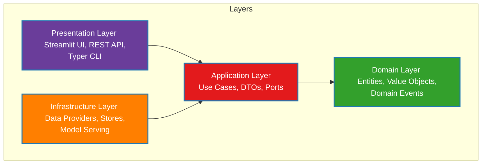
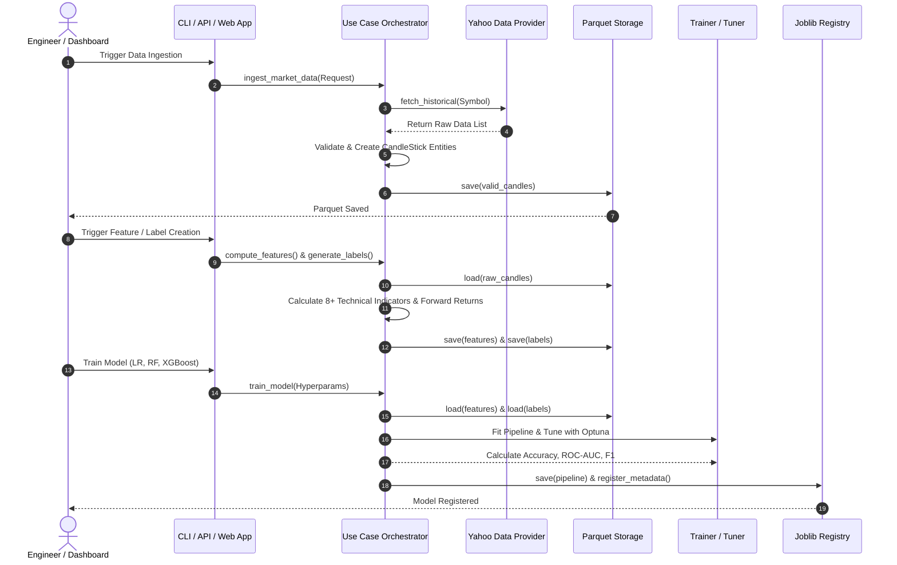
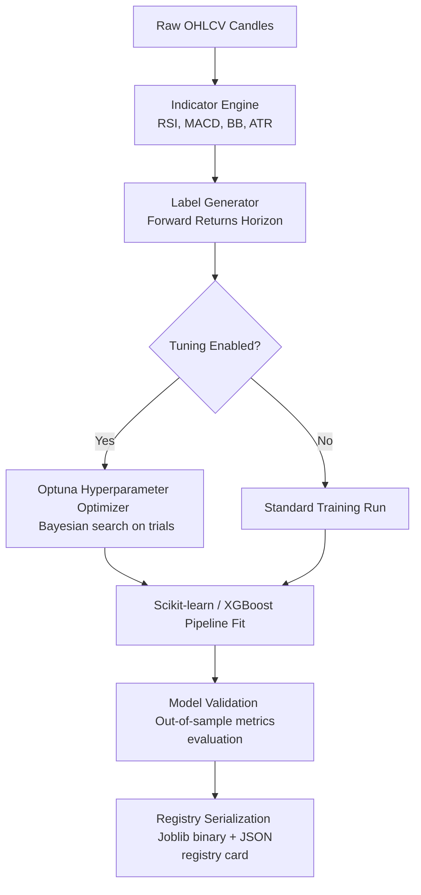

# Architecture Documentation

This document describes the high-level system architecture, design decisions, and data processing workflows for the **AI-Driven Candlestick Prediction Platform**.

The project is designed using the principles of **Clean Architecture** (sometimes referred to as Ports and Adapters or Hexagonal Architecture). This guarantees strict separation of concerns, complete testability of core business rules, and low coupling between components.

---

## 1. System Components (Clean Architecture Layers)

The system is split into four distinct concentric layers:

### Domain Layer (`domain/`)
- Contains the fundamental, core business logic and entities.
- Zero dependencies on any external libraries, frameworks, database drivers, or web frameworks.
- Includes:
  - `CandleStick`: Represents a historical OHLCV pricing bar and wicks/body logic.
  - `Symbol`: Value object representing normalized trading tickers.
  - `IndicatorValue` & `CandlePattern`: Represent computed metrics and patterns.
  - `LabeledSample`: Extracted model target variables (UP/DOWN based on returns).

### Application Layer (`application/`)
- Defines the workflow orchestration and orchestrates the business use cases.
- Relies purely on interfaces (ports) to interact with databases, filesystems, and external web APIs.
- Includes:
  - **Use Cases**: Ingestion orchestration, feature computation, model training, prediction pipelines, and quantitative backtesters.
  - **Ports**: Interfaces like `DataProvider`, `StorageAdapter`, `ModelStore`, and `FeatureStore`.
  - **DTOs**: Data Transfer Objects used to transfer input/output cleanly across application boundaries (e.g. `BacktestResult`, `CandlePrediction`).

### Infrastructure Layer (`infrastructure/`)
- Realizations of the ports (adapters) that talk to real external dependencies.
- Handles storage persistence (Parquet files), web querying (yfinance API client), and model serialization (joblib).
- Includes:
  - `YahooProvider`: Pulls historical market data using `yfinance`.
  - `ParquetStore`: Persists tabular candles, features, and labels to disk in Apache Parquet format.
  - `JoblibStore`: Serializes and deserializes trained model pipelines.
  - `ModelRegistry`: A JSON-backed catalog tracking trained models, training dates, and test performance.

### Presentation Layer (`presentation/`)
- Exposes user interfaces, shell tools, or network services.
- Includes:
  - **Streamlit Dashboard** (`dashboard/app.py`): Institutional Bloomberg-style interface.
  - **FastAPI REST API** (`api/main.py`): Endpoints exposing the model engine.
  - **Typer CLI** (`cli/main.py`): Commands for batch execution and management.

---

## 2. End-to-End Data Flow Diagram

The diagram below outlines how raw market data flows through the pipelines and is utilized by models for inference and evaluation:

---

## 3. Machine Learning Model Lifecycle

The platform models follow a strictly controlled lifecycle:

### 1. Ingestion & Storage
Raw ticker candles are pulled from market providers, validated against business validation constraints (e.g. high >= max(open, close), no negative pricing), and saved to binary Parquet files.

### 2. Feature & Label Engineering
- Technical indicators (momentum, volatility, trend oscillators) are calculated using vectorized pandas operations.
- Out-of-sample binary classifications (UP/DOWN price movements) are engineered by calculating future returns over a user-defined prediction horizon.

### 3. Model Training & Optimization
Models (Logistic Regression, Random Forest, XGBoost) are configured with standard hyperparameters or tuned using Optuna. The training pipeline performs auto-scaling, fits the models, calculates classification metrics (ROC-AUC, F1, Accuracy, Precision, Recall), and serializes the state to disk.

### 4. Prediction & Backtesting Serving
The latest registered models are retrieved on-demand by the REST API, Streamlit dashboard, or CLI. Feature vectors are aligned in real-time to generate directional probabilities. The backtester consumes predictions to simulate trades and compute Sharpe Ratios, equity curves, drawdowns, and monthly yields.
